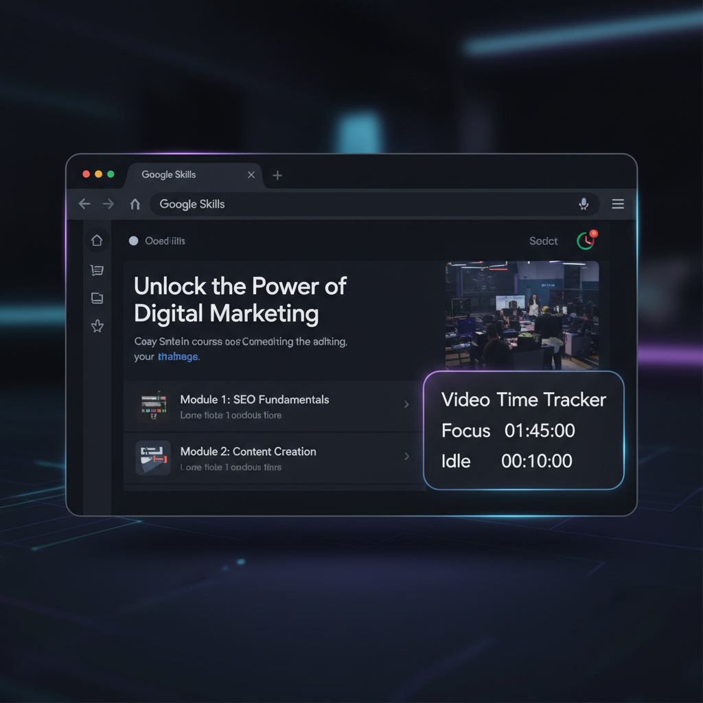
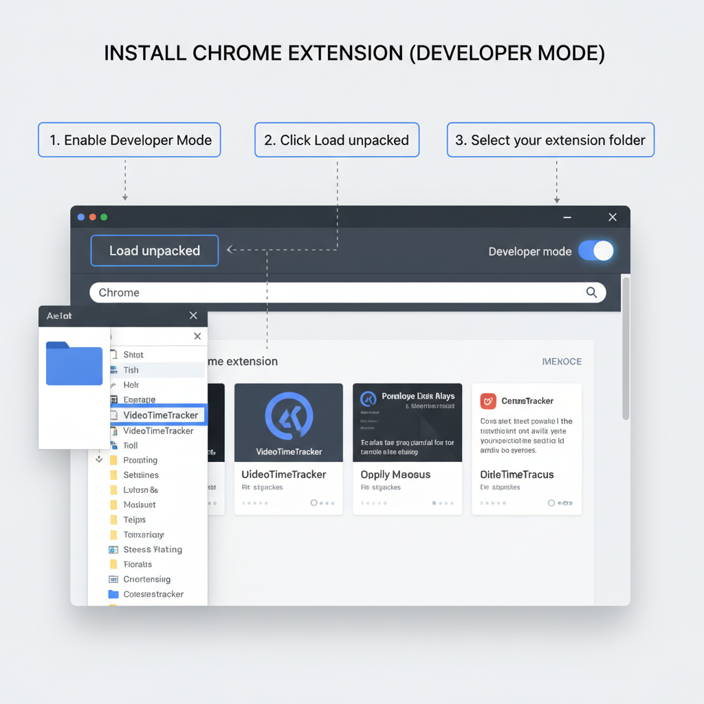
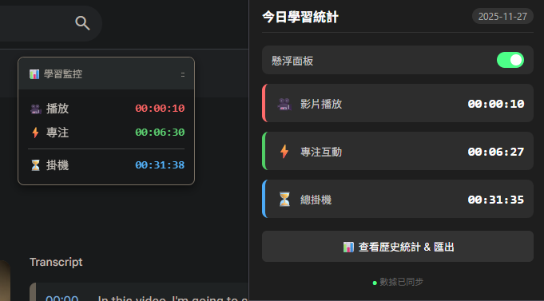

# Video Time Tracker - Google Skills 學習時數追蹤器

這是一個輕量級的瀏覽器擴充功能 (Chrome/Edge/Brave)，專為 [Google Skills](https://www.skills.google/) 學習平台設計。它能精確追蹤您的影片觀看時間、專注互動時間與掛機時間，並支援跨裝置數據同步與 Excel 匯出。

<!-- 在此處插入專案 Banner 或主要截圖 -->


## ✨ 主要功能

*   **🎥 精確影片計時**：
    *   智慧偵測嵌入式 YouTube 播放器。
    *   **只有在影片實際播放時**才計時（自動排除暫停、緩衝時間）。
    *   防止在一般 YouTube 網站瀏覽時誤觸發計時。

*   **⚡ 智慧互動偵測**：
    *   判定使用者是否「專注」於學習。
    *   當影片播放中，或暫停時有滑鼠/鍵盤操作（如做筆記、答題），皆視為有效互動時間。
    *   閒置超過 30 秒自動停止計算互動時數。

*   **📊 懸浮儀表板 (Overlay)**：
    *   在課程頁面右下角顯示即時數據面板。
    *   **可拖曳**：自由移動面板位置，且會自動記憶上次位置。
    *   **Shadow DOM 技術**：樣式完全隔離，不影響原始網頁排版。

*   **☁️ 跨裝置同步**：
    *   利用瀏覽器帳號 (Google/Microsoft) 的 Sync API 自動備份數據。
    *   在家用桌機與公司筆電之間無縫接軌學習進度。

*   **📅 歷史統計與匯出**：
    *   內建月曆檢視，可查看過去每日的學習時數。
    *   支援匯出 **CSV (Excel)** 報表，方便進行數據分析。

## 📥 安裝教學

由於本擴充功能尚未上架商店，請依照以下步驟手動安裝：

1.  **下載程式碼**：
    *   點擊 GitHub 頁面右上角的 `Code` > `Download ZIP` 並解壓縮，或使用 Git Clone：
        ```bash
        git clone https://github.com/Yuru778/VideoTimeTracker.git
        ```

2.  **開啟擴充功能管理頁面**：
    *   **Chrome**: 網址列輸入 `chrome://extensions`
    *   **Edge**: 網址列輸入 `edge://extensions`
    *   **Brave**: 網址列輸入 `brave://extensions`

3.  **載入擴充功能**：
    *   開啟右上角的 **「開發者模式」 (Developer mode)** 開關。
    *   點擊左上角的 **「載入未封裝項目」 (Load unpacked)**。
    *   選擇本專案的資料夾 (`VideoTimeTracker`)。

<!-- 在此處插入安裝步驟截圖 -->


## 📖 使用說明

1.  **開始學習**：
    *   前往 [Google Skills](https://www.skills.google/) 並登入。
    *   進入任何含有影片的課程頁面。
    *   您會看到右下角出現黑色的懸浮面板，開始自動計時。

2.  **查看統計**：
    *   點擊瀏覽器右上角的擴充功能圖示（拼圖圖示）。
    *   **今日面板**：顯示當天的即時數據。
    *   **歷史統計**：點擊按鈕查看月曆視圖與匯出功能。
    *   **開關懸浮窗**：可在 Popup 中隨時開啟或關閉網頁上的懸浮面板。

<!-- 在此處插入 Popup 與月曆介面截圖 -->


## 🛠️ 開發與技術細節

本專案使用純 Vanilla JavaScript 開發，不依賴任何外部框架，確保輕量與效能。

### 檔案結構
*   `manifest.json`: 定義權限 (Manifest V3)。
*   `content.js`: 核心邏輯。
    *   負責注入 Iframe 監聽 YouTube 播放狀態。
    *   計算 Delta Time 避免計時器誤差。
    *   實作 Shadow DOM 懸浮視窗與拖曳邏輯。
*   `popup.html/js/css`: 使用者介面與數據視覺化 (月曆)。
*   `background.js`: 背景服務 (目前僅用於監聽安裝事件)。

### 權限說明
*   `storage`: 用於儲存學習數據 (`chrome.storage.sync`) 與設定 (`chrome.storage.local`)。
*   `host_permissions`:
    *   `https://www.skills.google/*`: 主學習網站。
    *   `*://*.youtube.com/*`: 用於進入 Iframe 監聽播放狀態 (有嚴格的 Referrer 檢查機制，不會竊取一般 YouTube 瀏覽數據)。

## 🤝 貢獻

歡迎提交 Issue 或 Pull Request 來改進這個專案！

## 📄 授權

MIT License